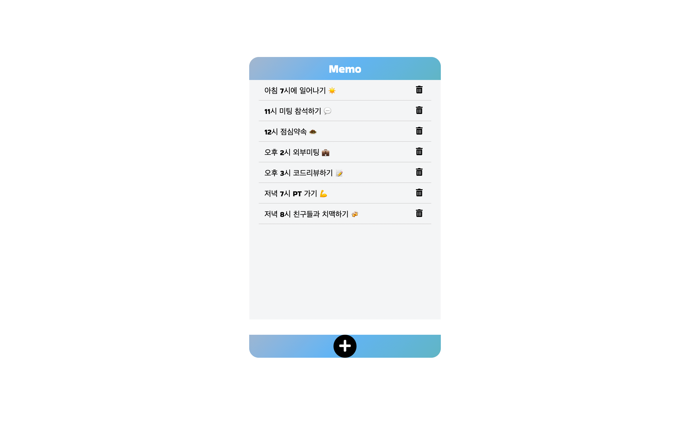

## 바닐라JS를 이용해 만드는 Memo📝
- 무엇이는 메모할 수 있는 간단한 Memo 입니다. 
<figure>
   
    <figcaption>메모 사용중 화면 </figcaption>
</figure>

## 프로젝트 소개 
텍스트를 입력후 ➕ 버튼 또는 키보드에서 Enter를 누르면 메모장에 텍스트가 입력됩니다. 
🗑 버튼을 클릭하면 해당 메모가 삭제됩니다.

### 기술스택 
- HTML, CSS, JAVASCRIPT

### 🔗 실행 페이지 
- https://salangdung-i.github.io/memo/
### Screen Shot 📸
<figure>
   
    <figcaption>초기 화면</figcaption>
</figure>

<figure>
     
    <figcaption>텍스트 입력 화면</figcaption>
</figure>

<figure>
    
    <figcaption>휴지통 클릭시 화면</figcaption>
</figure>
