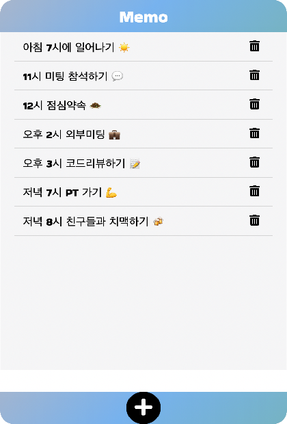
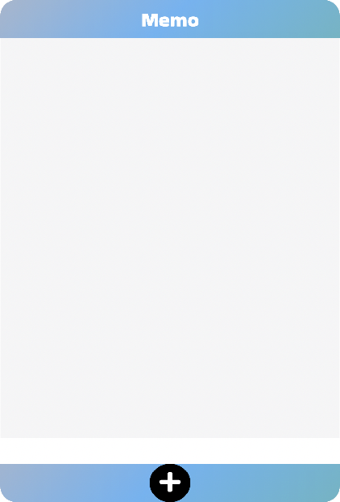
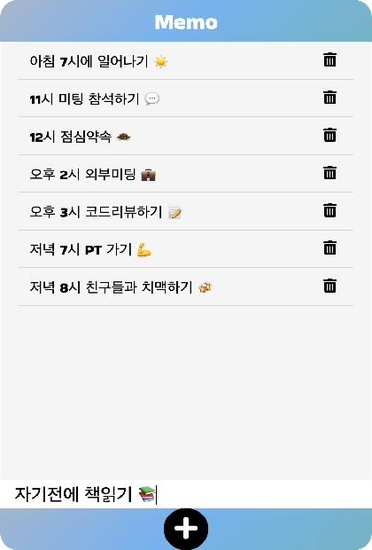
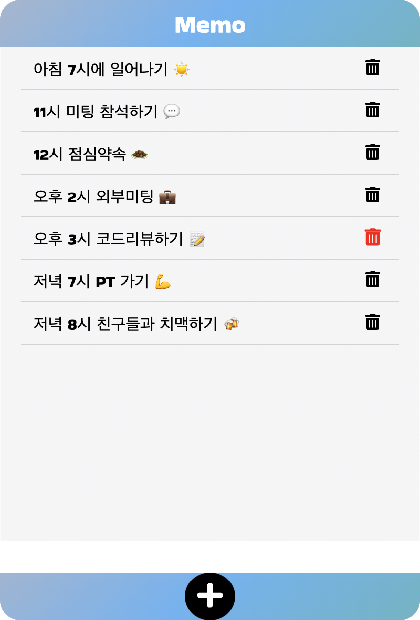

## 바닐라JS를 이용해 만드는 Memo📝
   

##### 뭐든 메모할 수 있는 간단한 Memo 입니다.    
 

## 프로젝트 소개 
- 텍스트를 입력후 ➕ 버튼 또는 키보드에서 Enter를 누르면 메모장에 텍스트가 입력됩니다.
- 🗑 버튼을 클릭하면 해당 메모가 삭제됩니다.  
 

## 기술스택 
- HTML, CSS, JAVASCRIPT  
 

## 🔗 실행 페이지 
- https://salangdung-i.github.io/memo/  
 

## 📸 Screen Shot 

   
   
   

 이미지1 : 초기 실행화면입니다.  
 이미지2 : 텍스트 입력화면입니다. ➕ 버튼 또는 키보드에서 Enter 누르면 텍스트가 입력됩니다.  
 이미지3 : 휴지통 이미지에 마우스를 가져가면 휴지통이 빨간색으로 변하며 이미지의 크기가 살짝커집니다. 클릭하면 해당 이미지가 삭제됩니다.

